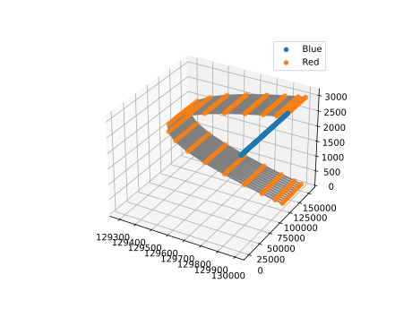

##  基于强化学习的空战对抗决策算法

### air-combat-Reinforcement-Learning

原作者实现时采用了Tensorflow 1.x ，鉴于TF1.x的晦涩难懂，作者花了一点时间使用pytorch 重新实现大佬的代码， 增加了图示 ， 对于算法的具体细则（我不是很懂 ！！！！！）。

感谢
https://github.com/y8107928/air-combat-Reinforcement-Learning.git

### 以下内容为原作者的注解

利用值函数逼近网络设计无人机空战自主决策系统，采用epsilon贪婪策略，三层网络结构。
其中包含了无人机作为质点时的运动模型和动力学模型的建模。
由于无人机作战的动作是连续并且复杂的，本项目仅考虑俯仰角gamma(又叫航倾角)和航向角pusin的变化，并且离散的规定每次变化的幅度为10度，假定速度v为恒定值。根据飞机的运动模型，由俯仰角、航向角和速度可以推算出飞机位置的改变，即x,y,z三个方向的速度分量，在每一步中，根据这些分量变化位置position信息，posintion中的三个值为x,y,z坐标，是东北天坐标系下的坐标值。从坐标信息和角度信息以及速度信息，可以计算出两个飞机的相对作战态势state。
在上文中提到，我们的动作是仅对俯仰角和航向角进行改变，即增大，减少和不变，故两个角度的变化组合一共有3×3=9种动作。在每个态势下，都有9种动作可以选择，将这个态势下的9种动作将会产生的新的态势，作为网络的输入，网络的输出是9个数字，代表每个动作的值函数。
由于是无监督学习，故我们需要利用值函数的Bellman公式生成标签。本文利用时间差分思想，（时间差分的公式贴在此处）。
怎么生成标签呢？我们先进行一次完整的游戏，将这次游戏中所有的值都记录下来，然后在游戏结束之后，根据胜利（红方为我方）、失败和最大步数、超出范围等给出一个回报值，然后设定一个回报的衰减率，将这个回报值根据步数越靠前影响越小的规律添加在每一步的目标中。
胜利的标准是，在攻击距离内达到攻击角度，这个以后再讲。
循环进行以上过程。

在训练后的结果图：
<h3>成功对抗状态</h3>

<h3>对抗超出包络</h2>

在对方匀速直线运动向我方飞行的时候，我方先快速爬升到一定高度，然后俯冲向敌机。
动作集的设定很暴力，在以后可以根据一些算法对动作集进行一定的改变。
#### 目前是初步的程序编写，最近比较忙，之后会不断更新和详解。  {原作者 说的！}
 

class_env文件是环境类，包含了无人机建模和各种坐标角度与态势之间的转换
main文件是主文件，有网络和主要的执行过程和测试过程

